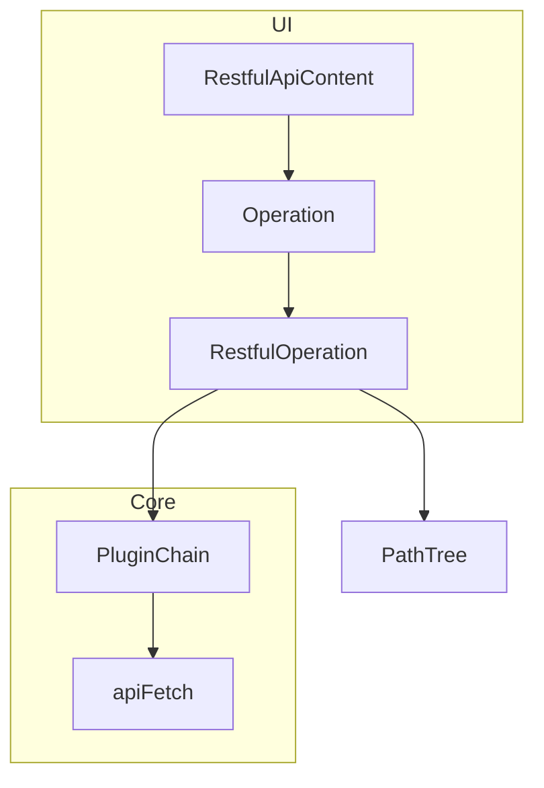
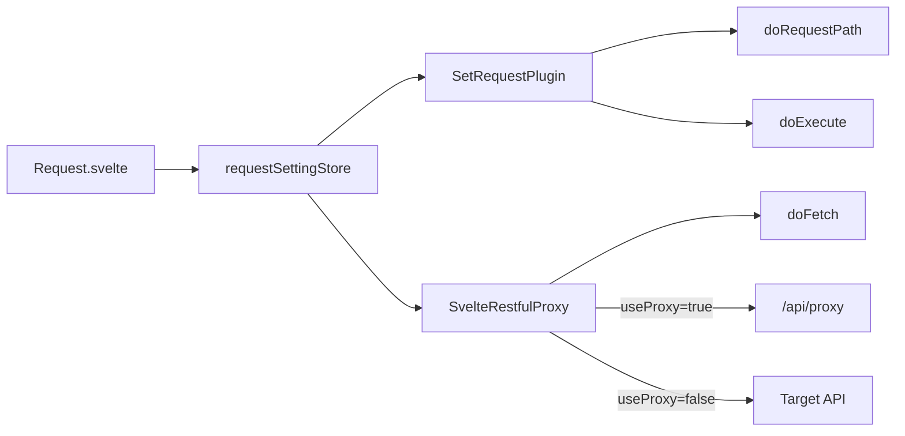

# Internal architecture

RESTful UI’s code layout, execution flow, and plugin system. Minimal local development steps are at the end.

## Chapter 1 — Project layout

```
src/
├── lib/
│   ├── restful/           # RestfulOperation, PathTree, ConfigStore, BuiltInPlugins, apiFetch
│   ├── components/        # UI (restful / common / app)
│   ├── adapters/svelte/   # Svelte wiring for settings, cache, proxy plugins
│   ├── mcp/               # MCP server (shares RestfulOperation)
│   ├── auth/              # Auth integration
│   └── server/            # CORS helpers, etc.
├── routes/                # SvelteKit: /, /cid/[cid], api/* (server build mode only)
├── service-worker.ts      # GET response cache
static/oas/                # Bundled sample OpenAPI specs
```

| Directory | Role |
|-----------|------|
| `lib/restful/` | OpenAPI execution core (shared by UI and MCP) |
| `lib/adapters/svelte/` | Browser storage and plugin wiring for Svelte |
| `routes/api/` | Server build mode only (proxy, configs, mcp) |

---

## Chapter 2 — Two launch modes

SvelteKit routes map to [`RuningMode`](../src/lib/restful/RestfulInterfaces.ts):

| Route | Mode | Where settings live |
|-------|------|---------------------|
| `/` — [`UrlBasePage`](../src/lib/components/restful/call/url-base/UrlBasePage.svelte) | `SESSION_STORAGE` | Browser (session / IndexedDB) |
| `/cid/{id}/` — [`ConfigLoaderRestfulApi`](../src/lib/components/restful/call/config-loader/ConfigLoaderRestfulApi.svelte) | `LOAD_CONFIG` | Server ConfigStore + browser |

Config mode characteristics:

- Link base becomes `/cid/{id}/` (`PathParameterLinkSupport`)
- Settings **Persist** tab is enabled (server build mode only)
- Changes to `requestSettings` sync automatically to `PUT /api/configs/{id}`

---

## Chapter 3 — Hash routing

SvelteKit handles page URLs only; **operation selection and parameters live in the hash query**.

[`RestfulApi.svelte`](../src/lib/components/restful/base/RestfulApi.svelte) parses everything after `#` in `$page.url.href` as `URLSearchParams`.

### Main parameters

| Parameter | Meaning |
|-----------|---------|
| `*page` | `top` / `operation` / `setting` |
| `path` | OpenAPI path (e.g. `/pet/findByStatus`) |
| `method` | HTTP method |
| Others | Operation input parameters |

### Link generation

[`DefaultLinkSupport`](../src/lib/restful/RestfulInterfaces.ts) builds URLs like:

```
{basePath}#?*page=operation&path=/pet/{petId}&method=get&petId=1
```

After Execute, [`Operation.svelte`](../src/lib/components/restful/base/Operation.svelte) updates the hash via `history.replaceState`. Bookmarks and shared URLs reproduce the same operation.

---

## Chapter 4 — Execution core



### RestfulOperation

Resolves path/method from the OpenAPI document, initializes parameters, builds URLs, and executes. Also discovers deeper operations (`getUnderOperations`).

### PathTree

Builds a hierarchy tree from flat `paths` keys for the sidebar ([`PathTree.ts`](../src/lib/restful/PathTree.ts)).

### apiFetch

Normalizes raw `Response` to `{ ok, status, responseBody, responseBodyType }` ([`apiFetch.ts`](../src/lib/restful/apiFetch.ts)).

### Response schema parsing

`getPropertyDefinitions` merges JSON schema from 200 responses (`properties` / `allOf`) for table columns and `x-restfului-link` detection.

### OpenAPI v2 / v3 branching

[`createRestfulOperation`](../src/lib/restful/RestfulOperation.ts) switches implementation based on `document.swagger`:

| Item | v2 | v3 |
|------|----|----|
| Base URL | `schemes` + `host` + `basePath` | `servers` + variable expansion |
| Body | `parameters[in=body]` | `requestBody.content` |
| Body formats | JSON only (form not implemented) | JSON + form |
| Response schema | `responses[].schema` | `responses[].content[...].schema` |

---

## Chapter 5 — Browser storage

[`createRestfulComponentConfig`](../src/lib/adapters/svelte/RestfulSvelteAdapter.ts) creates stores with a `{storageKey}-*` prefix.

| Store key | Contents | Storage |
|-----------|----------|---------|
| `-responses` | GET response cache | IndexedDB (Service Worker — [`sw-persisted-store.ts`](../src/lib/stores/sw-persisted-store.ts)) |
| `-parameter-histories` | POST/PUT body history (max 10) | sessionStorage |
| `-request-setting` | basePath, headers, useProxy, etc. | sessionStorage |
| `-table-key`, `-datatable-*` | Table UI state | sessionStorage |

`CachedRestfulPlugin` + `SvelteCacheStore` bridge cache read/write.

Try-it-out responses are **not sent to the server** by design. See [network-and-security.md](network-and-security.md). The Settings **Storage** tab ([`Storage.svelte`](../src/lib/components/restful/setting/Storage.svelte)) lets you inspect and edit raw JSON.

---

## Chapter 6 — Request settings flow



[`AbstractRequestSettingApplyPlugin`](../src/lib/restful/BuiltInPlugins.ts) handles basePath replacement, extra query, and header merge. For Settings UI, see also [exploring-apis.md](exploring-apis.md).

---

## Chapter 7 — Static build mode code paths

When `BUILD_MODE === 'static'`, these features are gated (matches [deployment.md](deployment.md)):

| Location | Behavior |
|----------|----------|
| [`hooks.server.ts`](../src/hooks.server.ts) | Auth handler disabled |
| [`Header.svelte`](../src/lib/components/app/Header.svelte) | Sign-in UI hidden |
| [`Request.svelte`](../src/lib/components/restful/setting/Request.svelte) | Proxy checkbox hidden |
| [`Settings.svelte`](../src/lib/components/restful/base/Settings.svelte) | Persist tab hidden |
| [`svelte.config.js`](../svelte.config.js) | `adapter-static`; no `api/*` |

---

## Chapter 8 — ConfigStore (server)

Persists OpenAPI configs in server build mode. Implementation is selected by `STORE_TYPE` ([`getConfigStore.ts`](../src/lib/restful/config-server/getConfigStore.ts)).

| Implementation | Use |
|----------------|-----|
| `FsConfigStore` | Local JSON files |
| `InMemoryConfigStore` | Dev / tests |
| `UpstashConfigStore` | Redis (serverless) |
| `PostgresConfigStore` | PostgreSQL |

API: `/api/configs`, `/api/configs/[id]`. For env and operations, see [deployment.md](deployment.md).

---

## Chapter 9 — Plugins

[`RestfulPlugin`](../src/lib/restful/RestfulPlugin.ts) uses chain of responsibility with four hooks:

| Hook | When |
|------|------|
| `doRequestPath` | Building request URL |
| `doInitializeRestInputParameters` | Initial parameters |
| `doExecute` | Full execution (logging, cache save, etc.) |
| `doFetch` | Actual fetch (via proxy, etc.) |

### Built-in plugins

| Plugin | Role | Injected from |
|--------|------|---------------|
| `CachedRestfulPlugin` | GET / body history | `RestfulApiContent` |
| `SetRequestPlugin` | headers, basePath, query | `createRestfulComponentConfig` |
| `SvelteRestfulProxy` | CORS proxy | same |
| `LoggingRestfulPlugin` | Request/response log | UrlBase / ConfigLoader |
| `McpRequestSettingsPlugin` | MCP settings | [`openapi-mcp-server.ts`](../src/lib/mcp/openapi-mcp-server.ts) |

### RestfulComponentConfig extension points

[`RestfulComponentConfig`](../src/lib/restful/RestfulInterfaces.ts) allows swapping:

- `additionalPlugins` — custom plugins
- `linkSupport` — URL generation (embedded hosts)
- `displaySupport` — array response extraction
- `storage` — persistence backend

For non-Svelte environments, add an adapter under `lib/adapters/` that wires plugins to the same `RestfulOperation` (see `lib/adapters/svelte/`).

### Custom plugin (minimal example)

```typescript
import { EmptyRestfulPlugin, type ExecutePluginChain } from '$lib/restful/RestfulPlugin';

class MyPlugin extends EmptyRestfulPlugin {
  async doExecute(operation, chain, inputParameters, input, init) {
    const response = await chain.next(inputParameters, input, init);
    return response;
  }
}
```

Add to `additionalPlugins` on the object returned by `createRestfulComponentConfig`.

---

## Chapter 10 — MCP reuse

MCP tool execution uses the same `createRestfulOperation` → `execute` path ([`McpTool.ts`](../src/lib/mcp/setup/McpTool.ts)). For HTTP endpoints and Cursor setup, see [mcp.md](mcp.md).

---

## Chapter 11 — Local development (minimal)

```bash
pnpm install
cp .env.example .env
pnpm run dev    # http://localhost:4210
```

For solo development, set `STORE_TYPE=fs` in `.env` to save configs under `mcp-configs/`. For production DB/KV details, see [deployment.md](deployment.md).
