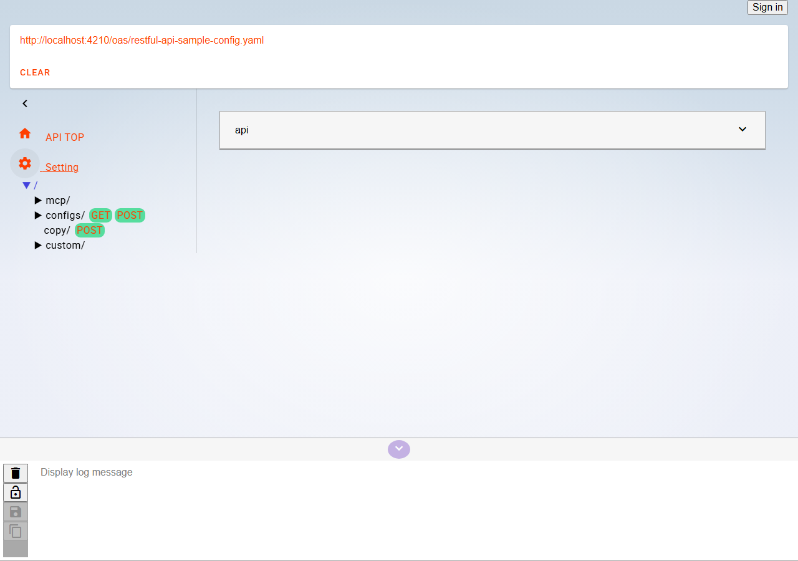
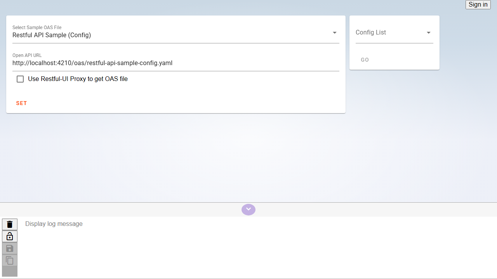
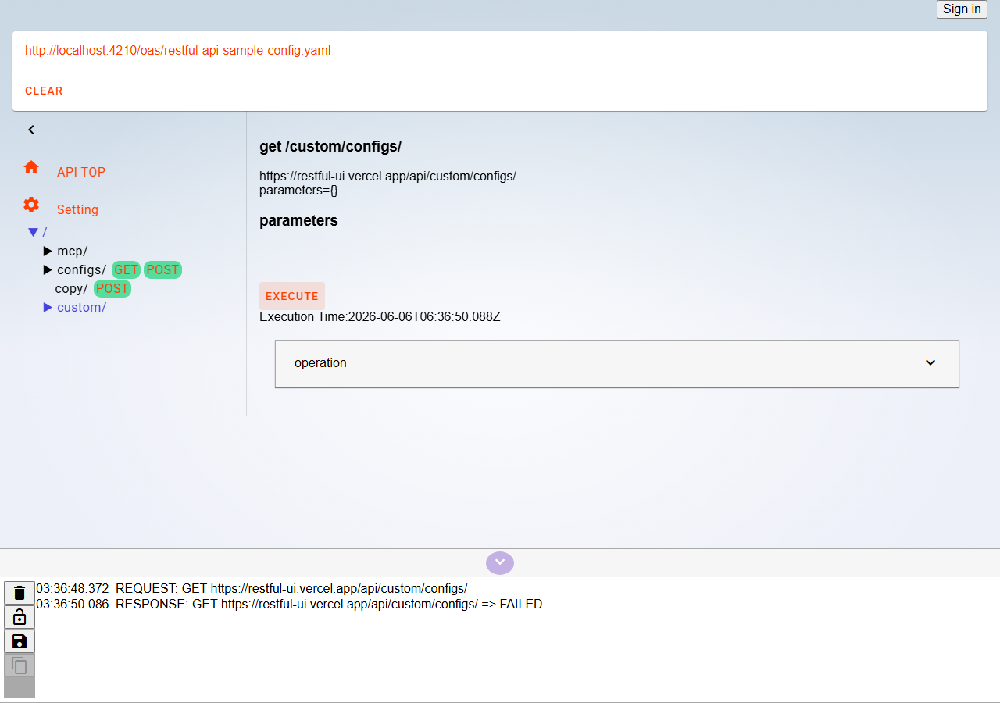
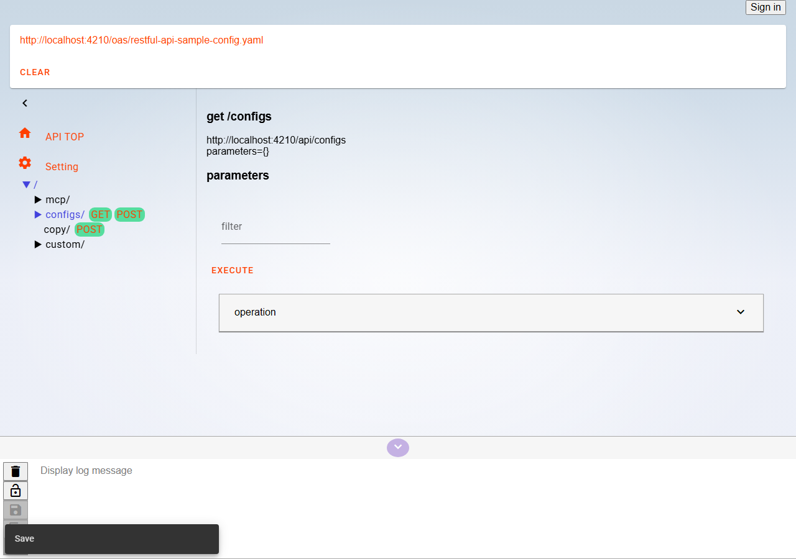
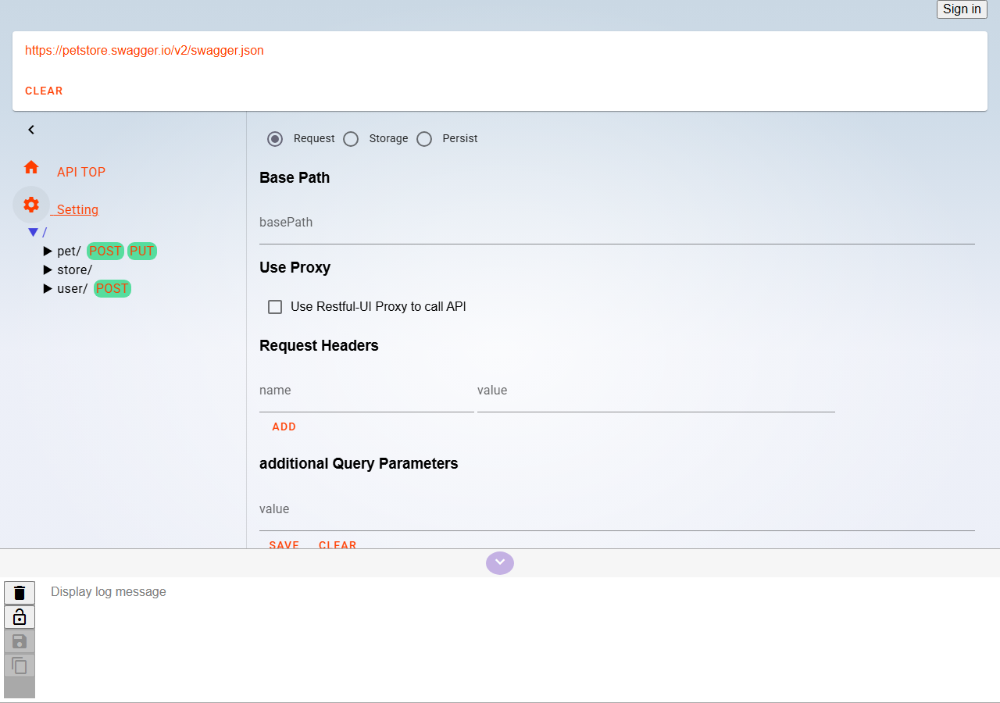

# Exploring APIs and OpenAPI extensions

How to load OpenAPI specs in RESTful UI, navigate from lists to details while trying APIs, and how to write the `x-restfului-link` extension.

## Part A — Basic usage

### 1. Loading OpenAPI

On the home page, enter an OpenAPI URL and click **set**. After the spec is parsed, the API TOP view appears and the path tree shows in the left drawer.



- OpenAPI v2 / v3 supported (`$ref` resolved via `@apidevtools/swagger-parser`)
- Bundled samples live under `static/oas/`; locally you can reference them at `/oas/...`

**Try it**

- Demo: <a href="https://funkjk.github.io/restful-ui/" target="_blank" rel="noopener noreferrer">GitHub Pages (static build mode / Explorer demo)</a>
- Spec: `https://petstore.swagger.io/v2/swagger.json`

---

### 2. Drilling down by path hierarchy

When a collection GET response is an array, it is shown as a table. Use the **list** button next to column values (IDs, etc.) to open operations on deeper paths.

RESTful UI automatically detects **deeper paths** than the current one (e.g. `/configs` → `/configs/{configurationId}`) from the OpenAPI definition (`getUnderOperations`).



**Steps (bundled sample `restful-api-sample-config.yaml`)**

1. Load `/oas/restful-api-sample-config.yaml` locally
2. In Settings, set **Base path** to `http://localhost:4210/api` and click **Save** (when using `pnpm run dev`)
3. Open `GET /configs` and click **Execute**
4. In the table’s `configurationId` column, click **list**
5. Choose a link such as `GET /configs/{configurationId}` in the dialog — the selected ID is carried into the next request’s parameters



**Try it**

- Local: `/oas/restful-api-sample-config.yaml` → Settings → Base path `http://localhost:4210/api` → `GET /configs`

---

### 3. Path tree

The left drawer shows the full path hierarchy. Jump to an operation via method links.



---

### 4. PUT workflow

For update methods, you can edit based on a prior GET result or body history.

1. `GET` the target resource
2. Successful GETs are cached in the browser (re-shown for the same URL and initial parameters)
3. On `PUT` / `POST`, recall past bodies from **Parameter histories**
4. Edit only the fields you want and click **Execute**

Caching is implemented via `CachedRestfulPlugin` and IndexedDB through the Service Worker. See [development.md](development.md) (Browser storage) for details.

---

### 5. Table view

- Responses whose **top-level body is an array** are shown as a table
- For nested arrays, pick the target key with **Select table key**
- Column filters and visible columns are saved per operation in sessionStorage

PathLink columns (list buttons) are enabled when:

- The column matches a `{param}` on a deeper path (path parameter name equals column name)
- `x-restfului-link` is defined on the schema (Part B)

---

### 6. Settings (request settings)

Open the drawer’s **Setting** tab to change shared request options.



| Item | Description |
|------|-------------|
| Base path | Replace the OpenAPI base URL with a runtime URL |
| Headers | Headers applied to every request |
| Additional query | Query string appended to every URL |
| Use Restful-UI Proxy | Server build mode only. CORS proxy (**OFF by default**) |

For proxy ON/OFF and traffic paths, see [network-and-security.md](network-and-security.md).

---

## Part B — OpenAPI extension `x-restfului-link`

RESTful UI’s custom extension is **`x-restfului-link`**. It declares links from response schema properties to related operations that path hierarchy alone cannot reach (different paths, GETs with query parameters, etc.).

### Where to write it

- A **property** on the 200 response schema
- For **array** types, on `items`

### Format

```yaml
# Single link
id:
  type: string
  x-restfului-link: /custom/configs/{id}

# Multiple links (array)
"owl:sameAs":
  type: string
  x-restfului-link:
    - "/odpt:StationTimetable?odpt:calendar={owl:sameAs}"
```

Linked operations are always **GET**. Write path and query to match OpenAPI path keys.

### Placeholders

| Placeholder | Replaced with |
|-------------|---------------|
| `{value}` / `{$value}` | Cell value |
| `{columnName}` | Cell value when it matches the column name |
| `{other}` | Same-named field on the row object (e.g. `{owl:sameAs}`) |

### Example 1 — Bundled sample

[`static/oas/restful-api-sample-config.yaml`](../static/oas/restful-api-sample-config.yaml):

```yaml
id:
  type: string
  x-restfului-link: /custom/configs/{id}
```

**Try it**

- Local: load `/oas/restful-api-sample-config.yaml`, run `GET /custom/configs/`

### Example 2 — ODPT API (link outside path hierarchy)

[`static/oas/odpt-api-openapi.yaml`](../static/oas/odpt-api-openapi.yaml):

```yaml
"owl:sameAs":
  type: string
  x-restfului-link:
    - "/odpt:StationTimetable?odpt:calendar={owl:sameAs}"
```

Jump from a calendar ID to the timetable API via **another path + query**.

**Try it**

- Local: load `/oas/odpt-api-openapi.yaml`, run the relevant GET and check the `owl:sameAs` column’s list button in the response table

### Fallback without the extension

Even without `x-restfului-link`, columns whose names match **path parameters on deeper paths** become PathLink columns automatically (Part A §2). The `configurationId` column on `GET /configs` is an example.

### Hierarchy vs explicit extension

| Approach | When to use |
|----------|-------------|
| Path hierarchy (automatic) | REST-style parent/child paths like `/pets` → `/pets/{id}` |
| `x-restfului-link` | Cross-resource references, filtered GETs, graph-like relations |

---

## Related docs

- [deployment.md](deployment.md) — Build modes and deployment
- [development.md](development.md) — Internal architecture and plugins
- [network-and-security.md](network-and-security.md) — Traffic paths and security
- [mcp.md](mcp.md) — MCP integration
- [README.md](../README.md) — Project overview
