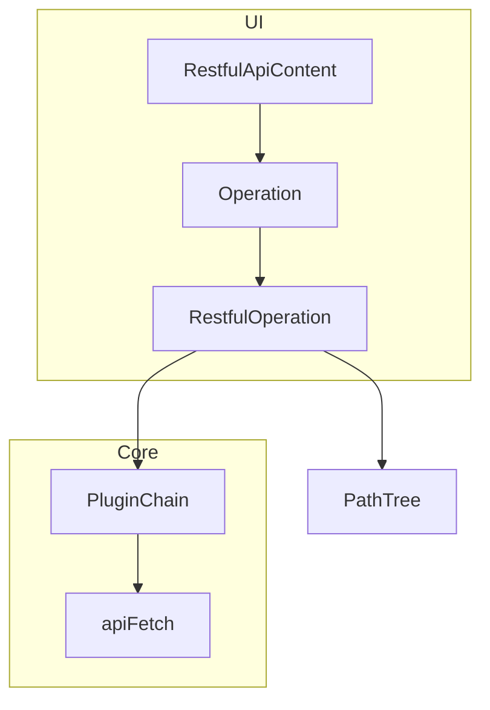
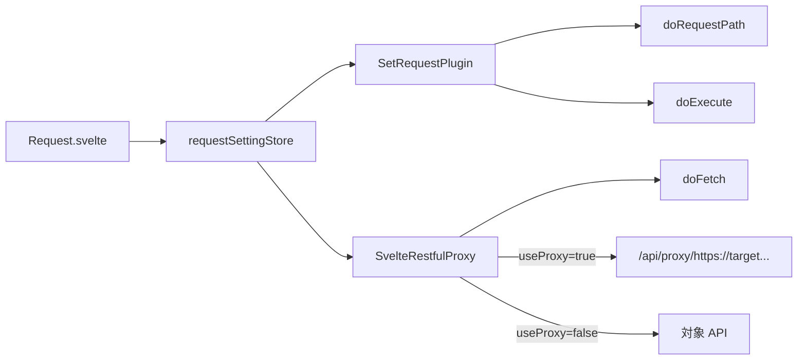

# 内部構成

RESTful UI のコード構成、実行の流れ、プラグイン機構を説明します。ローカル開発の最小手順も末尾に記載しています。

## 第1章 — プロジェクト構成

```
src/
├── lib/
│   ├── restful/           # RestfulOperation, PathTree, ConfigStore, BuiltInPlugins, apiFetch
│   ├── components/        # UI（restful / common / app）
│   ├── adapters/svelte/   # Svelte 向け設定・キャッシュ・プロキシプラグイン
│   ├── mcp/               # MCP サーバー（RestfulOperation を共用）
│   ├── auth/              # 認証連携
│   └── server/            # CORS ヘルパ等
├── routes/                # SvelteKit: /, /cid/[cid], api/*（サーバービルドモードのみ）
├── service-worker.ts      # GET レスポンスキャッシュ
static/oas/                # 同梱サンプル OpenAPI
```

| ディレクトリ | 役割 |
|-------------|------|
| `lib/restful/` | OpenAPI 実行コア（UI・MCP 共通） |
| `lib/adapters/svelte/` | ブラウザ storage とプラグインの Svelte 向け配線 |
| `routes/api/` | サーバービルドモードのみ（proxy, configs, mcp） |

---

## 第2章 — 2 つの起動モード

SvelteKit ルートと [`RuningMode`](../../src/lib/restful/RestfulInterfaces.ts) の対応:

| ルート | モード | 設定の保存先 |
|--------|--------|-------------|
| `/` — [`UrlBasePage`](../../src/lib/components/restful/call/url-base/UrlBasePage.svelte) | `SESSION_STORAGE` | ブラウザ（session / IndexedDB） |
| `/cid/{id}/` — [`ConfigLoaderRestfulApi`](../../src/lib/components/restful/call/config-loader/ConfigLoaderRestfulApi.svelte) | `LOAD_CONFIG` | サーバー ConfigStore + ブラウザ |

Config モードの特徴:

- リンク base が `/cid/{id}/` になる（`PathParameterLinkSupport`）
- Settings の **Persist** タブが有効（サーバービルドモードのみ）
- `requestSettings` の変更が `PUT /api/configs/{id}` に自動同期

---

## 第3章 — ハッシュルーティング

SvelteKit はページ URL のみ担当し、**operation 選択・パラメータは hash クエリ**に載ります。

[`RestfulApi.svelte`](../../src/lib/components/restful/base/RestfulApi.svelte) が `$page.url.href` の `#` 以降を `URLSearchParams` として解析します。

### 主なパラメータ

| パラメータ | 意味 |
|-----------|------|
| `*page` | `top` / `operation` / `setting` |
| `path` | OpenAPI path（例: `/pet/findByStatus`） |
| `method` | HTTP メソッド |
| その他 | operation の入力パラメータ |

### リンク生成

[`DefaultLinkSupport`](../../src/lib/restful/RestfulInterfaces.ts) が次の形式の URL を組み立てます:

```
{basePath}#?*page=operation&path=/pet/{petId}&method=get&petId=1
```

Execute 後、[`Operation.svelte`](../../src/lib/components/restful/base/Operation.svelte) が `history.replaceState` で hash を現在のパラメータに更新します。ブックマークや URL 共有で同じ operation を再現できます。

---

## 第4章 — 実行コア



### RestfulOperation

OpenAPI document から path/method を解決し、パラメータ初期化・URL 組み立て・execute を行います。下位 operation の探索（`getUnderOperations`）もここにあります。

### PathTree

フラットな `paths` キーから階層ツリーを構築し、サイドバー表示に使います（[`PathTree.ts`](../../src/lib/restful/PathTree.ts)）。

### apiFetch

raw `Response` を `{ ok, status, responseBody, responseBodyType }` に正規化します（[`apiFetch.ts`](../../src/lib/restful/apiFetch.ts)）。

### レスポンス schema 解析

`getPropertyDefinitions` が 200 レスポンスの JSON schema（`properties` / `allOf`）をマージし、テーブル列と `x-restfului-link` 検出の元データになります。

### OpenAPI v2 / v3 分岐

[`createRestfulOperation`](../../src/lib/restful/RestfulOperation.ts) が `document.swagger` の有無で実装を切り替えます:

| 項目 | v2 | v3 |
|------|----|----|
| Base URL | `schemes` + `host` + `basePath` | `servers` + 変数展開 |
| Body | `parameters[in=body]` | `requestBody.content` |
| Body 形式 | JSON のみ（form は未実装） | JSON + form |
| Response schema | `responses[].schema` | `responses[].content[...].schema` |

---

## 第5章 — ブラウザストレージ

[`createRestfulComponentConfig`](../../src/lib/adapters/svelte/RestfulSvelteAdapter.ts) が `{storageKey}-*`  prefix で store を生成します。

| Store キー | 内容 | 保存先 |
|-----------|------|--------|
| `-responses` | GET レスポンスキャッシュ | IndexedDB（Service Worker — [`sw-persisted-store.ts`](../../src/lib/stores/sw-persisted-store.ts)） |
| `-parameter-histories` | POST/PUT body 履歴（最大 10 件） | sessionStorage |
| `-request-setting` | basePath, headers, useProxy 等 | sessionStorage |
| `-table-key`, `-datatable-*` | テーブル UI 状態 | sessionStorage |

`CachedRestfulPlugin` + `SvelteCacheStore` がキャッシュ读写の橋渡しをします。

Try it out のレスポンスは **サーバーに送らない**設計です。詳細は [network-and-security.md](network-and-security.md) を参照してください。Settings の **Storage** タブ（[`Storage.svelte`](../../src/lib/components/restful/setting/Storage.svelte)）で生 JSON を確認・編集できます。

---

## 第6章 — リクエスト設定の流れ



[`AbstractRequestSettingApplyPlugin`](../../src/lib/restful/BuiltInPlugins.ts) が basePath 差し替え・追加 query・ヘッダ merge を担当します。Settings UI からの設定変更は [exploring-apis.md](exploring-apis.md) も参照してください。

---

## 第7章 — 静的ビルドモードのコード分岐

`BUILD_MODE === 'static'`のときにコード上で切れる機能（[deployment.md](deployment.md) の静的ビルドモード説明と対応）:

| 箇所 | 挙動 |
|------|------|
| [`hooks.server.ts`](../../src/hooks.server.ts) | 認証ハンドラ無効 |
| [`Header.svelte`](../../src/lib/components/app/Header.svelte) | サインイン UI 非表示 |
| [`Request.svelte`](../../src/lib/components/restful/setting/Request.svelte) | プロキシ checkbox 非表示 |
| [`Settings.svelte`](../../src/lib/components/restful/base/Settings.svelte) | Persist タブ非表示 |
| [`svelte.config.js`](../../svelte.config.js) | `adapter-static`、`api/*` 不在 |

---

## 第8章 — ConfigStore（サーバー側）

サーバービルドモードで OpenAPI 設定を永続化する抽象化です。env `STORE_TYPE` で実装が切り替わります（[`getConfigStore.ts`](../../src/lib/restful/config-server/getConfigStore.ts)）。

| 実装 | 用途 |
|------|------|
| `FsConfigStore` | ローカル JSON ファイル |
| `InMemoryConfigStore` | 開発・テスト |
| `UpstashConfigStore` | Redis（serverless） |
| `PostgresConfigStore` | PostgreSQL |

API: `/api/configs`, `/api/configs/[id]`。運用上の選び方・env は [deployment.md](deployment.md) を参照してください。

---

## 第9章 — プラグイン

[`RestfulPlugin`](../../src/lib/restful/RestfulPlugin.ts) は chain of responsibility パターンで、4 つのフックを提供します。

| フック | タイミング |
|--------|-----------|
| `doRequestPath` | リクエスト URL 組み立て |
| `doInitializeRestInputParameters` | 初期パラメータ |
| `doExecute` | 実行全体（ログ、キャッシュ保存など） |
| `doFetch` | 実際の fetch（プロキシ経由など） |

### 組み込みプラグイン

| プラグイン | 役割 | 注入元 |
|-----------|------|--------|
| `CachedRestfulPlugin` | GET / body 履歴 | `RestfulApiContent` |
| `SetRequestPlugin` | headers, basePath, query | `createRestfulComponentConfig` |
| `SvelteRestfulProxy` | CORS プロキシ | 同上 |
| `LoggingRestfulPlugin` | リクエスト/レスポンスログ | UrlBase / ConfigLoader |
| `McpRequestSettingsPlugin` | MCP 用 settings | [`openapi-mcp-server.ts`](../../src/lib/mcp/openapi-mcp-server.ts) |

### RestfulComponentConfig 拡張ポイント

[`RestfulComponentConfig`](../../src/lib/restful/RestfulInterfaces.ts) で次を差し替え可能です:

- `additionalPlugins` — カスタムプラグイン追加
- `linkSupport` — URL 生成（埋め込みホスト向け）
- `displaySupport` — 配列レスポンスの抽出ロジック
- `storage` — 永続化 backend の差し替え

非 Svelte 環境向け adapter を追加する場合は、`lib/adapters/svelte/` を参考に同じ `RestfulOperation` にプラグインを載せる形になります。

### カスタムプラグイン（最小例）

```typescript
import { EmptyRestfulPlugin, type ExecutePluginChain } from '$lib/restful/RestfulPlugin';

class MyPlugin extends EmptyRestfulPlugin {
  async doExecute(operation, chain, inputParameters, input, init) {
    // 前処理
    const response = await chain.next(inputParameters, input, init);
    // 後処理
    return response;
  }
}
```

`createRestfulComponentConfig` の戻り値の `additionalPlugins` に追加します。

---

## 第10章 — MCP との共用

MCP の tool 実行も `createRestfulOperation` → `execute` をそのまま利用します（[`McpTool.ts`](../../src/lib/mcp/setup/McpTool.ts)）。HTTP エンドポイントと Cursor 連携の手順は [mcp.md](mcp.md) を参照してください。

---

## 第11章 — ローカル開発（最小限）

```bash
pnpm install
cp .env.example .env
pnpm run dev    # http://localhost:4210
```

個人開発では `.env` に `STORE_TYPE=fs` を指定すると、設定が `mcp-configs/` に保存されます。本番用 DB/KV の詳細は [deployment.md](deployment.md) を参照してください。
