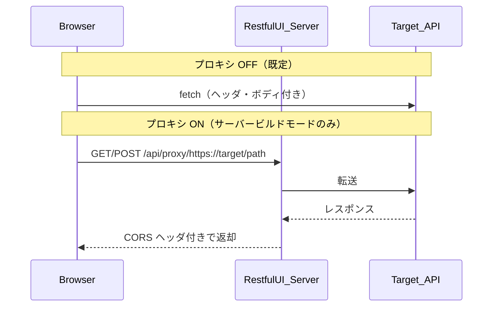

# 通信とセキュリティ

RESTful UI で Try it out したとき、データがどこを通るかを整理します。

## 1. プロキシが必要な理由（CORS）

### ブラウザの制限

RESTful UI を `https://restful-ui.vercel.app` などで開き、別オリジン（例: `https://api.example.com`）の API を Try it out すると、ブラウザは **CORS** をチェックします。

対象 API が次のようなレスポンスヘッダを返さない場合、JavaScript からレスポンス body を読めません。

- `Access-Control-Allow-Origin`
- プリフライトが必要なメソッド・ヘッダに対する許可

DevTools ではネットワーク上は 200 でも、コンソールに CORS エラーが出ることがあります。

### プロキシ ON のとき

1. ブラウザは設定された **cors-anywhere 互換** プロキシを呼ぶ（既定: 同一オリジンの `/api/proxy`、または `PUBLIC_CORS_PROXY_URL` 設定時はその URL）
2. プロキシが対象 API または OAS URL に転送する
3. プロキシがブラウザへ返す際に CORS ヘッダを付与する

Proxy base URL は **Settings → Request** と **OpenAPI URL 入力画面** の両方で変更できます。形式: `{proxyBase}/{targetUrl}`

### プロキシベース URL の初期値

| 条件 | 初期値 |
|------|--------|
| ビルド時に `PUBLIC_CORS_PROXY_URL` あり | その URL |
| 未設定 | 現在のオリジン + `/api/proxy`（`BUILD_BASE_PATH` 考慮） |

### 許可 Origin（`CORS_ALLOWED_ORIGINS`）

| 設定 | 挙動 |
|------|------|
| 未設定または空 | 任意の Origin から `/api/proxy` 利用可（`Access-Control-Allow-Origin: *`） |
| カンマ区切りリスト | リスト内の Origin のみ（例: `https://app.example.com,http://localhost:4210`）、それ以外は 403 |

`/api/configs` の CORS にも同じ変数を使用します。本番では RESTful UI の Origin のみに絞ることを推奨します。

### プロキシを ON にすべきケース

- 公開デモや開発中に、CORS 未設定の第三者 API を試したい
- API オーナーで、RESTful UI ホストを自分で運用している（転送経路を理解した上）

### プロキシを OFF のままにすべきケース（既定）

- 対象 API がすでにブラウザからの呼び出しを許可している
- **認証情報や社内 API** を RESTful UI ホストに載せたくない
- 自己ホストでプライバシーを最優先したい

設定場所: サーバービルドモードの Settings → **Use Restful-UI Proxy**（静的ビルドモードでは表示されません）

## 2. 通信経路

## 3. データの行き先（比較表）

| データ | プロキシ OFF | プロキシ ON | 静的ビルドモード |
|--------|--------------|-------------|----------|
| Try it out の API リクエスト | ブラウザ → 対象 API のみ | ブラウザ → RESTful UI サーバー → 対象 API | ブラウザ → 対象 API のみ |
| CORS | 対象 API の設定に依存 | プロキシ応答に ACAO 等を付与 | 対象 API の設定に依存 |
| Authorization 等のヘッダ | 対象 API にのみ | **ホストサーバーにも届く** | 対象 API にのみ |
| 保存した OAS 設定 | — | サーバー（fs / upstash / postgres 等） | — |
| レスポンス履歴・テーブル設定 | ブラウザ（IndexedDB / sessionStorage） | 同左（試行レスポンスはサーバーに送らない設計） | 同左 |

### 表現上の注意

「RESTful UI サーバーに送られない」は、**プロキシ OFF 時に Try it out がホストを経由しない**という意味です。対象 API にはブラウザから送信されます。ストレージの詳細は [development.md](development.md) の「ブラウザストレージ」を参照してください。

## 4. サーバービルドモードで別経路になるもの

Try it out とは独立して、次は **サーバー側** に関わります。

| 機能 | 説明 |
|------|------|
| **ConfigStore** | ユーザーが保存した OpenAPI 設定（`STORE_TYPE`） |
| **MCP HTTP** | `/api/mcp` 系 — [mcp.md](mcp.md) |

静的ビルドモード（静的ホスト）では上記のサーバー機能はありません。

## 5. 公開デモ（Vercel）を使うとき

[restful-ui.vercel.app](https://restful-ui.vercel.app/) は第三者が運用するデモです。

- プロキシを ON にすると、試行内容が **デモ運用者のサーバー** を経由します
- 機密のある API キーや本番データでの試行は避け、**自己ホスト**（[deployment.md](deployment.md)）を検討してください
- 設定の保存を使う場合は、自分の ConfigStore 環境で運用するのが安全です
