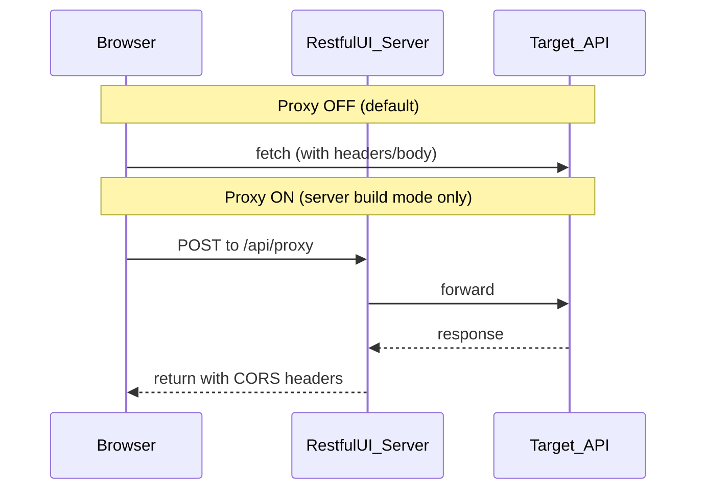

# Network and security

Where data goes when you use Try it out in RESTful UI.

## 1. Why a proxy is needed (CORS)

### Browser restrictions

If you open RESTful UI at `https://restful-ui.vercel.app` and try an API on another origin (e.g. `https://api.example.com`), the browser enforces **CORS**.

If the target API does not return headers such as:

- `Access-Control-Allow-Origin`
- Allowances for preflight methods and headers

JavaScript cannot read the response body. DevTools may show HTTP 200 while the console reports a CORS error.

### When proxy is ON

1. The browser calls only the **same-origin** RESTful UI host (e.g. `POST /api/proxy`)
2. The RESTful UI server forwards the request to the target API
3. The server adds CORS headers when returning to the browser ([`src/routes/api/proxy/[...path]/+server.ts`](../src/routes/api/proxy/[...path]/+server.ts))

### When to turn proxy ON

- Trying third-party APIs without CORS on a public demo or during development
- You operate the RESTful UI host and understand the forwarding path

### When to leave proxy OFF (default)

- The target API already allows browser calls
- You do not want **credentials or internal APIs** routed through the RESTful UI host
- Privacy-first self-hosting

Setting: server build mode → Settings → **Use Restful-UI Proxy** (hidden in static build mode)

## 2. Traffic paths

## 3. Where data goes (comparison)

| Data | Proxy OFF | Proxy ON | Static build mode |
|------|-----------|----------|-------------------|
| Try-it-out API requests | Browser → target API only | Browser → RESTful UI server → target API | Browser → target API only |
| CORS | Depends on target API | Proxy response adds ACAO, etc. | Depends on target API |
| Authorization and similar headers | Sent only to target API | **Also received by host server** | Sent only to target API |
| Saved OAS configs | — | Server (fs / upstash / postgres, etc.) | — |
| Response history, table UI state | Browser (IndexedDB / sessionStorage) | Same (try-it-out responses are not sent to the server by design) | Same |

### Wording note

“Not sent to the RESTful UI server” means **with proxy OFF, try-it-out does not go through the host**. Data is still sent from the browser to the target API. For storage details, see [development.md](development.md) (Browser storage).

## 4. Server-only paths in server build mode

Independent of try-it-out, these use the **server**:

| Feature | Description |
|---------|-------------|
| **ConfigStore** | Saved OpenAPI configs (`STORE_TYPE`) |
| **MCP HTTP** | `/api/mcp` routes — [mcp.md](mcp.md) |

Static build mode (static hosting) has none of the above.

## 5. Using the public demo (Vercel)

[restful-ui.vercel.app](https://restful-ui.vercel.app/) is a third-party demo.

- With proxy ON, try-it-out traffic passes through **the demo operator’s server**
- Avoid API keys and production data on public demos; consider **self-hosting** ([deployment.md](deployment.md))
- For saved configs, run your own ConfigStore environment
