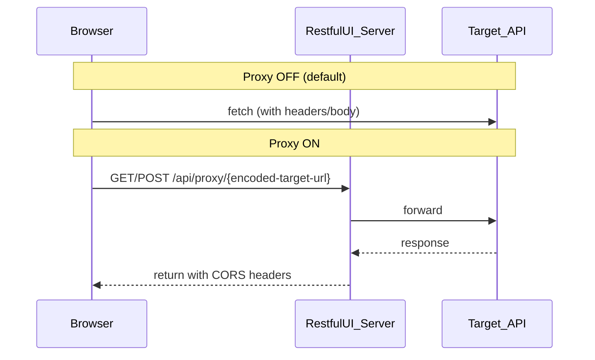

# Network and security

Where data goes when you use Try it out in RESTful UI.

## 1. Why a proxy is needed (CORS)

### Browser restrictions

If you open RESTful UI at `https://restful-ui.vercel.app` and try an API on another origin (e.g. `https://api.example.com`), the browser enforces **CORS**.

If the target API does not return headers such as:

- `Access-Control-Allow-Origin`
- Allowances for preflight methods and headers

JavaScript cannot read the response body. DevTools may show HTTP 200 while the console reports a CORS error.

### When proxy is ON

1. The browser calls the configured **cors-anywhere compatible** proxy (default: same-origin `/api/proxy`, or `PUBLIC_CORS_PROXY_URL` when set)
2. The proxy server forwards the request to the target API or OAS URL
3. The proxy adds CORS headers when returning to the browser

Proxy base URL can be changed in **Settings → Request** and on the **OpenAPI URL** entry screen.

**URL format:** `{proxyBase}/{encodeURIComponent(targetUrl)}` — the target URL is one encoded path segment (avoids `https://` collapsing in reverse-proxy paths).

Example: `/api/proxy/https%3A%2F%2Fapi.example.com%2Fpath` (same as cors-anywhere).

### Default proxy base URL

| Source | Initial value |
|--------|----------------|
| `PUBLIC_CORS_PROXY_URL` set at build/deploy | That URL |
| Not set | Current origin + `/api/proxy` (respects `BUILD_BASE_PATH`) |

### Allowed origins (`CORS_ALLOWED_ORIGINS`)

| Setting | Behavior |
|---------|----------|
| Unset or empty | Any origin may use `/api/proxy` (`Access-Control-Allow-Origin: *`) |
| Comma-separated list | Only listed origins (e.g. `https://app.example.com,http://localhost:4210`); others receive 403 |

Same variable applies to `/api/configs` CORS. In production, restrict to your RESTful UI origin.

### Localhost and remote proxies

A proxy server on Vercel (or any remote host) **cannot** fetch `http://localhost` or `127.0.0.1` on your PC. The server returns **400** for such targets; the UI may fall back to a direct browser fetch when the proxy base is on another origin.

| Scenario | What works |
|----------|------------|
| `pnpm run dev` + same-origin `/api/proxy` + `http://localhost:…` API | Yes (proxy and API on your machine) |
| GitHub Pages + Vercel proxy + `http://localhost:…` in Base path | No — use a public API URL or run RESTful UI locally |
| Static site + `PUBLIC_CORS_PROXY_URL` + public HTTPS API | Yes, if the proxy operator allows your Origin (`CORS_ALLOWED_ORIGINS`) |

### When to turn proxy ON

- Trying third-party APIs without CORS on a public demo or during development
- You operate the RESTful UI host and understand the forwarding path

### When to leave proxy OFF (default)

- The target API already allows browser calls
- You do not want **credentials or internal APIs** routed through the RESTful UI host
- Privacy-first self-hosting

Setting: **Settings → Request** → **Use CORS proxy** (also on the OpenAPI URL entry screen). In static build mode there is no same-origin `/api/proxy`; set **Proxy base URL** to an external server or rely on `PUBLIC_CORS_PROXY_URL` baked in at build time.

## 2. Traffic paths

## 3. Where data goes (comparison)

| Data | Proxy OFF | Proxy ON | Static build (proxy OFF) | Static build (proxy ON, external URL) |
|------|-----------|----------|--------------------------|---------------------------------------|
| Try-it-out API requests | Browser → target API only | Browser → proxy server → target API | Browser → target API only | Browser → external proxy → target API |
| CORS | Depends on target API | Proxy response adds ACAO, etc. | Depends on target API | Depends on proxy server |
| Authorization and similar headers | Sent only to target API | **Also received by proxy server** | Sent only to target API | **Also received by proxy server** |
| Saved OAS configs | — | Server (fs / upstash / postgres, etc.) | — | — |
| Response history, table UI state | Browser (IndexedDB / sessionStorage) | Same (try-it-out responses are not sent to the server by design) | Same | Same |

### Wording note

“Not sent to the RESTful UI server” means **with proxy OFF, try-it-out does not go through the host**. Data is still sent from the browser to the target API. For storage details, see [development.md](development.md) (Browser storage).

## 4. Server-only paths in server build mode

Independent of try-it-out, these use the **server**:

| Feature | Description |
|---------|-------------|
| **ConfigStore** | Saved OpenAPI configs (`STORE_TYPE`) |
| **MCP HTTP** | `/api/mcp` routes — [mcp.md](mcp.md) |

Static build mode (static hosting) has none of the above.

## 5. Using the public demo (Vercel)

<a href="https://restful-ui.vercel.app/" target="_blank" rel="noopener noreferrer">restful-ui.vercel.app</a> is a third-party demo.

- With proxy ON, try-it-out traffic passes through **the demo operator’s server**
- Avoid API keys and production data on public demos; consider **self-hosting** ([deployment.md](deployment.md))
- For saved configs, run your own ConfigStore environment
